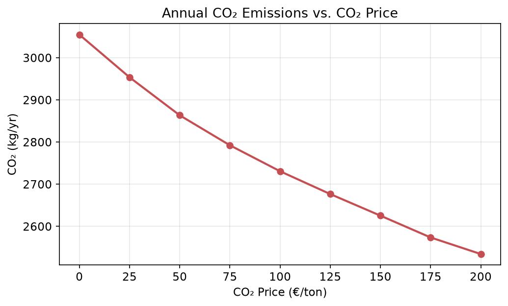
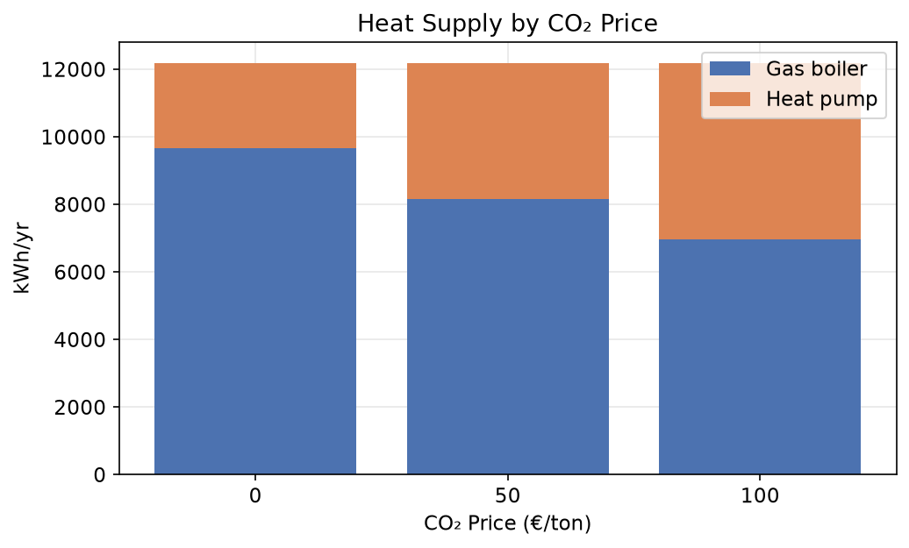
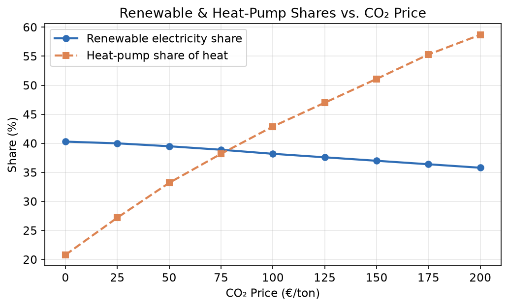
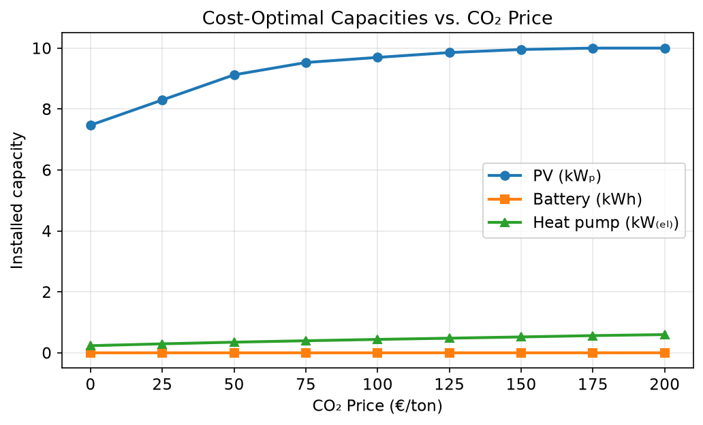

# Residential Energy System under CO₂ Pricing

I built this model during my M.Sc. in Mechanical Engineering (Sustainable Energy Systems) at Ruhr-Universität Bochum to answer a fairly practical question: **if you put a price on carbon, how should a single household invest in and run its energy system — and what does that actually do to its emissions and its bill?**

The household has four options to cover its electricity and heat: rooftop **PV**, a **battery**, an air-source **heat pump**, and a **gas boiler**. The model decides, all at once, both the *sizes* to install and the *hour-by-hour operation* over a full year (8,760 hours), so that total annual cost is as low as possible. I then repeat this for a range of CO₂ prices from €0 to €200 per tonne and look at how the answers change.

It's written as a linear program using [linopy](https://linopy.readthedocs.io/) and solved with the open-source HiGHS solver.

## What I found

A few results stood out to me:

- **Heating is where carbon pricing bites.** As the CO₂ price rises from €0 to €200/t, the heat pump goes from covering 21% of heat to 59%, pushing out the gas boiler. Heat is the biggest energy demand in the house (~12,200 kWh/yr vs ~3,100 kWh/yr of electricity), so this is the main lever.
- **Emissions fall, but moderately.** A €100/t price cuts annual CO₂ by about 11% (3,055 → 2,731 kg) and the full €200/t by 17%. The reduction is gradual because the heat pump's efficiency drops in winter — exactly when most heat is needed — so it never fully displaces gas at these prices.
- **PV is the cheapest move and it maxes out the roof.** The model installs PV right up to the 10 kWp roof limit and the household ends up exporting most of that generation. Even without a carbon price, PV pays for itself.
- **A battery never makes economic sense here.** Under a flat electricity tariff, the only value of storage is shifting surplus PV from export (€0.07/kWh) to self-use (€0.30/kWh), and that saving doesn't cover the battery's annual cost. This is a real conclusion, not a missing feature: you'd need time-of-use pricing to justify storage.
- **Costs rise gently.** Total annual cost goes from ~€2,090 (no carbon price) to ~€2,640 (€200/t) — roughly +26% for the strongest decarbonisation.

| CO₂ price (€/t) | Total cost (€/yr) | CO₂ (kg/yr) | Heat-pump share | PV installed (kWₚ) |
|---:|---:|---:|---:|---:|
| 0 | 2,093 | 3,055 | 21% | 7.5 |
| 100 | 2,380 | 2,731 | 43% | 9.7 |
| 200 | 2,643 | 2,535 | 59% | 10.0 (roof limit) |






## How the model works

It minimises total annual cost — grid electricity, gas, carbon, and the annualised cost of whatever PV / battery / heat-pump capacity it chooses to build, minus revenue from exporting PV — subject to:

- an **electricity balance** every hour (import + PV + battery discharge = demand + charging + heat-pump electricity + export),
- a **heat balance** every hour (gas boiler + heat pump = heat demand),
- **PV output** limited by sunshine and installed size,
- **battery state-of-charge** carried hour to hour with charge/discharge efficiency,
- and capacity limits (roof area, grid connection, charge/discharge power).

A couple of modelling choices I think are worth calling out, because they change the results a lot:

- **The heat pump's COP changes with outdoor temperature.** I didn't assume a fixed efficiency. I used the air-source heat-pump relationship from Staffell et al. (2012) driven by the hourly temperature data, so the COP sits around 2.9 on average but drops toward 2 on the coldest days.
- **Costs are annualised properly.** Instead of using raw equipment prices, I convert each technology's capital cost into an equivalent yearly cost using its lifetime and a 4% discount rate (a capital-recovery factor), so a single modelled year fairly compares running costs against investment.
- **Gas is priced.** The gas boiler pays a commodity price and a separate carbon cost — otherwise the heat pump could never compete and the whole question would be moot.

All the assumptions (prices, emission factors, efficiencies, lifetimes, limits) live in one `Config` block at the top of `src/model.py`, so they're easy to find and change.

## Data

Three hourly time series for one year, already included in `data/`:

| File | What it gives |
|---|---|
| `electricity_demand_clean.csv` | household electricity demand |
| `ninja_pv_51.1638_10.4478_corrected.csv` | PV capacity factor + outdoor temperature ([Renewables.ninja](https://www.renewables.ninja/)) |
| `ninja_demand_51.1638_10.4478_uncorrected.csv` | heat demand |

## Running it

```bash
pip install -r requirements.txt
python src/run_scenarios.py    # solves every CO₂ price, writes results/
python src/plot_results.py     # writes the figures
```

To explore, change `CO2_PRICES` in `run_scenarios.py` or any value in the `Config` block.

## What I'd do next

- **Add time-of-use electricity pricing.** This is the change that would make storage economically interesting — right now the flat tariff is the reason the battery stays at zero.
- **Model the heat pump's fixed installation cost.** A real heat pump has a large one-off cost regardless of size; capturing that properly turns this into a mixed-integer problem (install-or-not), which would make the adoption pattern more realistic.
- **Run several weather years** instead of one, to check how sensitive the sizing is.

## Notes

Single building, one weather year, perfect foresight, static technology costs — so the numbers are meant to show *mechanisms*, not to be a precise forecast. Data from Renewables.ninja and Open Power System Data; heat-pump COP relation from Staffell et al., *Energy & Environmental Science* (2012). Originally developed as a coursework project at the Chair of Energy Systems and Energy Economics, RUB.
